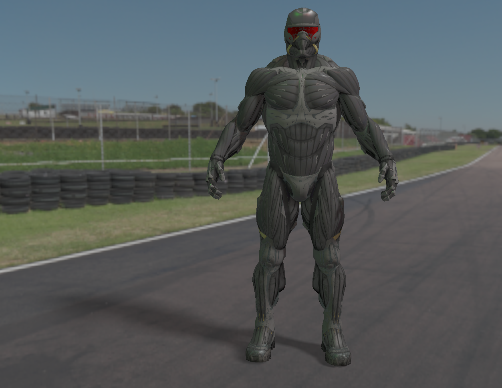
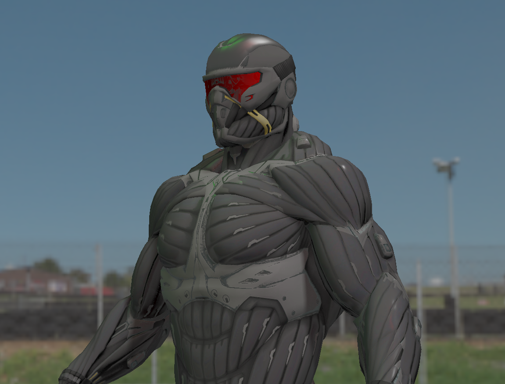
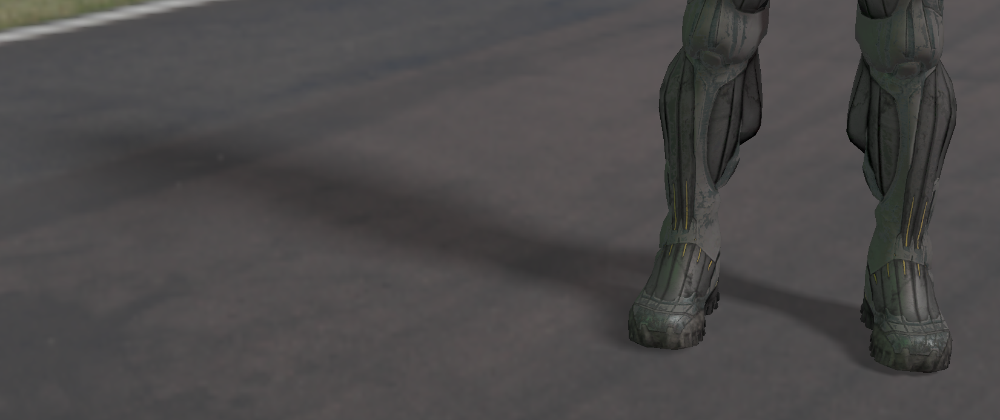

PBR + IBL + Shadow Mapping[PCSS].

This project includes a green light source at the front-left of the model and a red light source at the front-right, both using PBR (Physically-Based Rendering) for shading. An environment map is applied for image-based lighting (IBL) to adjust the diffuse lighting. Additionally, a main light source is positioned above the model on the right, with shadow mapping used to render its shadows.

Some images to show the render effect

